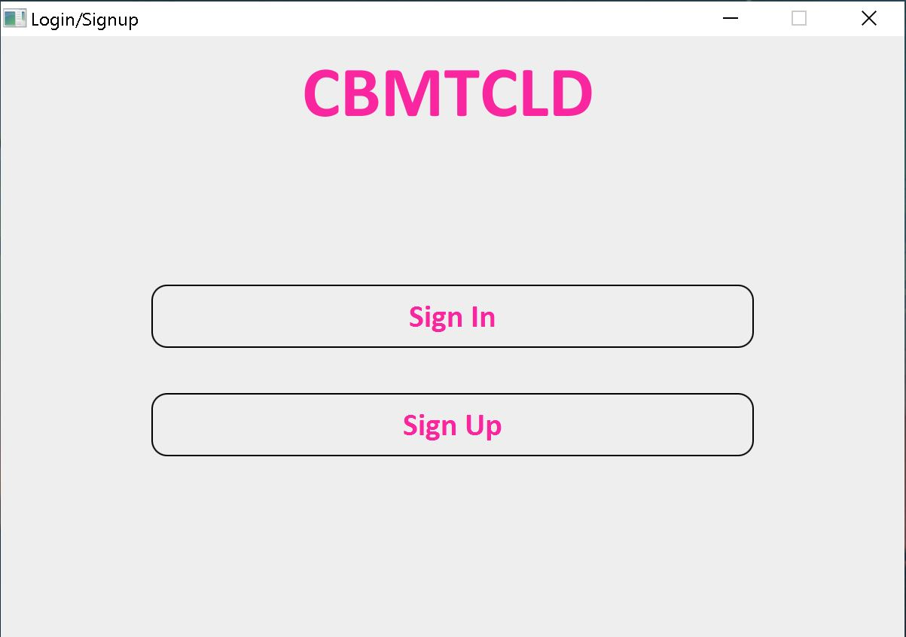
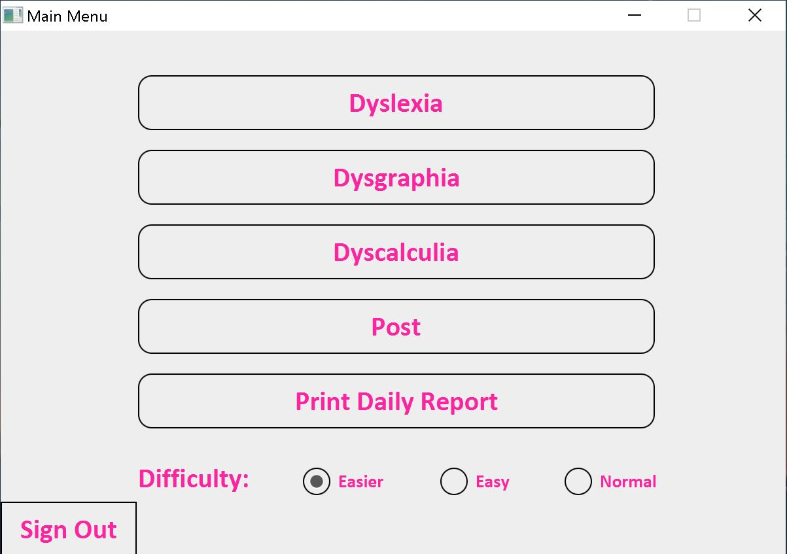
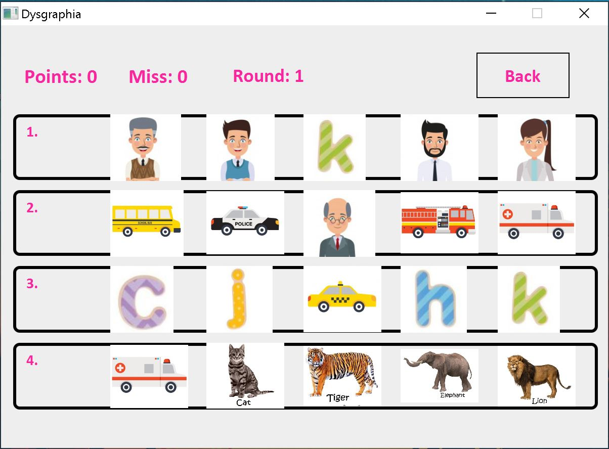
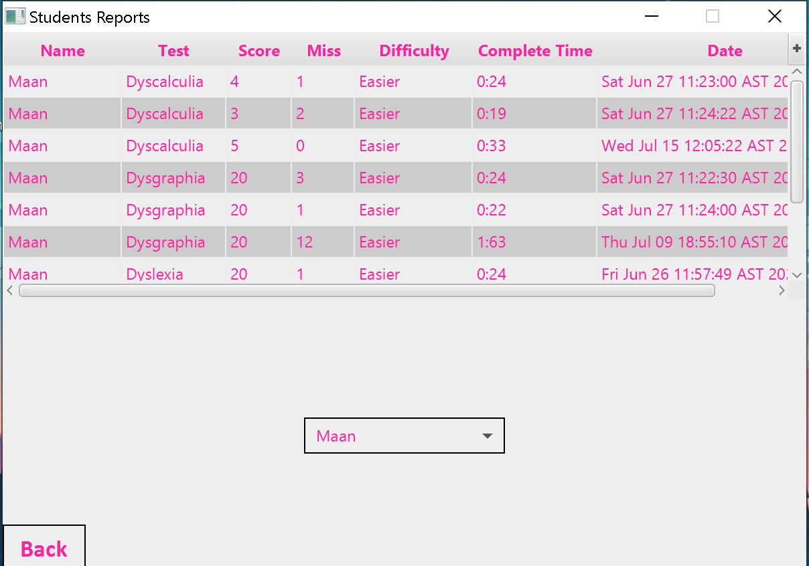
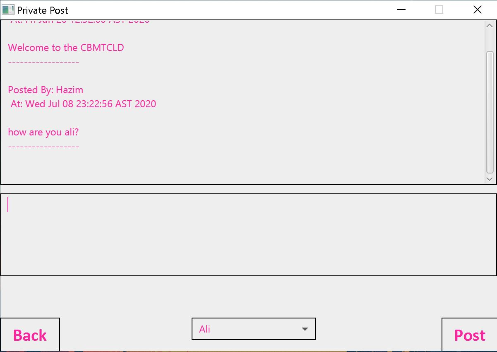
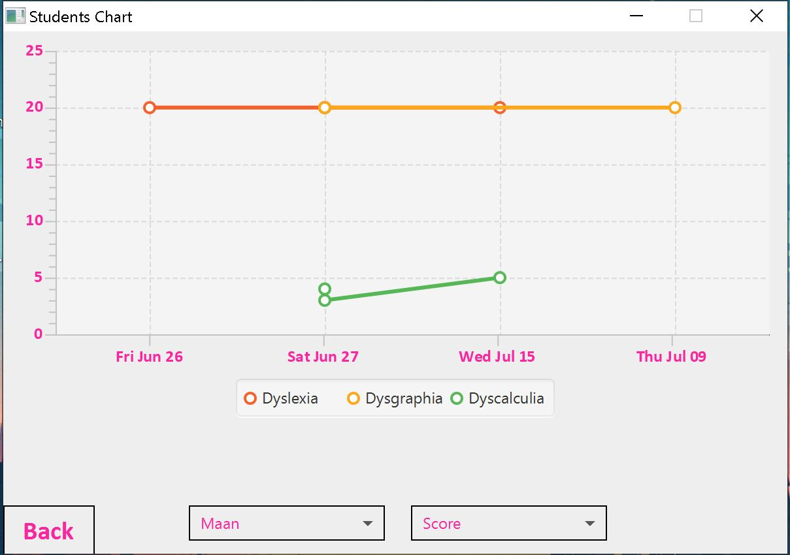

# CBMTCLD
# About
 A project to help children with learning disabilities through mini games, there are three types of learning disabilities in the program: Dyslexia, Dysgraphia, and Dyscalulia,
 each type has one game with three difficulties.

# Program featurs:
1- One game for each type of disabilities.  
2- Three difficulties for each game.  
3- Score and time tracking.  
4- Students can view thier history (score, time, date, type, difficulty, miss).  
5- Student can recive messages from thier teacher (public/private messages).  
6- Teachers can view thier students history (score, time, date, type, difficulty, miss).  
7- Teachers can view thier students performance through a graph (score, miss, time).  
8- Teachers can send messages to thier students (public/private messages).  
  
    
# Tools:
Java, and scene builder.  

# Screen Shots:
# Main menu:  
  
  
# Student main menu:  
  
  
# Dysgraphia:  
  
  
# Student/Teacher report:  
  
  
# Student/Teacher messages:  
  
  
# Teacher graph:  

